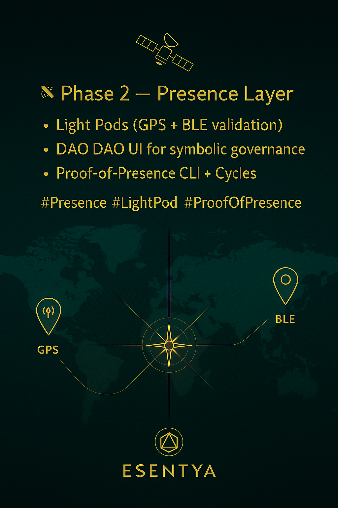

# 🌐 D. Esentya Protocol — Drop #1

**Identity. Worth. Dharma.**  
A regenerative Web3 ecosystem rooted in presence, trust, and symbolic value.

---

## 🚀 esentya-drop-1: What’s Live

Welcome to the **first public drop** of the [D. Esentya Protocol](https://github.com/D-Madhava-Deva/d-esentya-mvpv0.2) — a decentralized architecture for Soulbound Identity, Proof-of-Worth, DAO Lineage, and real-world regenerative impact.

This drop sets the **symbolic and technical foundation** of our ecosystem. It is not a dApp yet. It is a **living blueprint** — and **$D.Flow is already live** as a token on-chain.

> ⚠️ This is a pre-launch release. Our MVP and DAO logic are **under development**, and the protocol is currently maintained by the founding contributor until full decentralization is possible.

---

## 🪷 Core Documents

| File | Description |
|------|-------------|
| [`D-Esentya-Whitepaper.md`](./D-Esentya-Whitepaper.md) | Full protocol vision, architecture, and mechanisms |
| [`manifesto.md`](./manifesto.md) | Symbolic and ethical foundation of the movement |
| [`TOKENOMICS.md`](./TOKENOMICS.md) | Dual-token logic: $D.Flow (utility) + $D.WTH (worth) |
| [`DAO-TIERS.md`](./DAO-TIERS.md) | Structure of layered DAOs and Tier governance |
| [`CYCLES.md`](./CYCLES.md) | Esentya’s core life-cycle logic: Dream → Plan → Mint |
| [`VISION.md`](./VISION.md) | Dharma-driven statement of purpose and global intent |
| [`Roadmap.md`](./Roadmap.md) | High-level development stages and symbolic timeline |

---

## 🔮 Status Summary

- ✅ `$D.Flow` token deployed (fair launch via Pump.fun)
- ✅ Core architecture, docs, and roadmap defined
- ✅ Symbolic visual identity and whitepaper published
- ⚙️ MVP (CLI + smart contracts + DAO infra) in progress
- 🛠️ DAO-DAO + Identity mint contracts are next milestones

---

## 🎨 Visuals

Explore key visuals and roadmap slides in [`/RoadmapMidias`](./RoadmapMidias)

---

## 🧘 Who We Are

This is a **symbolic system, not just code**. D. Esentya was born as a living protocol grounded in service, ethics, and spiritual presence — Dharma first. Every element, from consensus to community, is designed to reflect **value through presence and purpose**.

---

## 🧩 How to Contribute

Right now, the ecosystem is not fully decentralized.  
We welcome **builders, designers, thinkers, organizers** — but you must wait for the **Esentya ID + DAO minting logic** to be live to start interacting inside the system.

In the meantime:

- Feel free to read and fork the repo
- Share and discuss our whitepaper
- Join the fair launch and explore $D.Flow
- Reach out on X/Twitter or by email if aligned

> 📬 Contact: [@DharmaEsentya](https://x.com/DharmaEsentya) · d.esentya@proton.me

---

## 🧠 Licensing & Ethics

All symbolic and written materials are under:

> **Creative Commons Attribution-ShareAlike 4.0 International (CC BY-SA 4.0)**  
> [View full license](./LICENSE)

Contracts and smart code will follow [GPL-3.0](https://www.gnu.org/licenses/gpl-3.0.en.html) or similar.

---

## 🌱 Acknowledgement

This is Drop #1.  
It is just the beginning.

Esentya is not another protocol.  
It’s a call to presence, to community, and to collective truth.

Let’s co-create something that deserves to exist.

> _“Dharma, when preserved, preserves.”_
